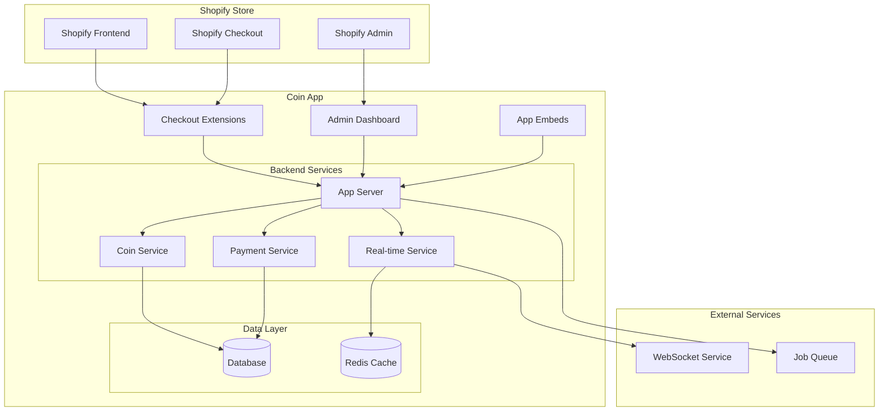

# Design Document: Shopify Coin Integration

## Overview

This design outlines a comprehensive Shopify app that provides a complete coin/points reward system. The app enables customers to earn and redeem coins through various store activities, with real-time balance updates and seamless checkout integration using Shopify's modern extensibility framework.

The system consists of three main components:
1. **Admin Dashboard**: Store owner configuration and analytics
2. **Checkout Extensions**: Customer-facing UI for coin redemption
3. **Backend Services**: Coin management, real-time sync, and payment processing

## Architecture

### High-Level Architecture



### Technology Stack

**Frontend:**
- React with TypeScript for admin dashboard
- Shopify Polaris for consistent UI components
- Shopify UI Extensions for checkout integration

**Backend:**
- Node.js with Express framework
- GraphQL for Shopify API integration
- WebSocket for real-time updates
- Redis for caching and session management

**Database:**
- PostgreSQL for persistent data storage
- Redis for real-time data and caching

**Infrastructure:**
- Shopify App Bridge for embedded app experience
- Shopify Functions for payment customization
- Shopify Webhooks for event handling

## Components and Interfaces

### 1. Admin Dashboard Component

**Purpose**: Store owner interface for configuring coin system and viewing analytics

**Key Features:**
- Coin earning rule configuration
- Exchange rate management
- Customer coin balance overview
- Transaction history and analytics
- Product eligibility settings

**Interface:**
```typescript
interface AdminDashboard {
  configureEarningRules(rules: EarningRule[]): Promise<void>
  setExchangeRate(rate: ExchangeRate): Promise<void>
  getCustomerBalances(filters: CustomerFilter): Promise<CustomerBalance[]>
  getAnalytics(dateRange: DateRange): Promise<Analytics>
}

interface EarningRule {
  id: string
  type: 'purchase' | 'signup' | 'referral' | 'review'
  coinAmount: number
  conditions?: RuleCondition[]
  isActive: boolean
}
```

### 2. Checkout Extensions Component

**Purpose**: Customer-facing UI for displaying coin balance and enabling redemption

**Extension Points:**
- Cart summary section
- Checkout payment methods
- Order confirmation page

**Interface:**
```typescript
interface CheckoutExtension {
  displayCoinBalance(customerId: string): Promise<CoinBalance>
  enableCoinRedemption(amount: number): Promise<RedemptionResult>
  validateRedemption(cartTotal: number, coinAmount: number): Promise<ValidationResult>
}

interface CoinBalance {
  totalCoins: number
  monetaryValue: number
  currency: string
  lastUpdated: Date
}
```

### 3. Coin Service Component

**Purpose**: Core business logic for coin management

**Responsibilities:**
- Coin earning calculations
- Balance tracking and updates
- Transaction history management
- Fraud detection and validation

**Interface:**
```typescript
interface CoinService {
  awardCoins(customerId: string, rule: EarningRule, context: EarningContext): Promise<Transaction>
  redeemCoins(customerId: string, amount: number, orderId: string): Promise<Transaction>
  getBalance(customerId: string): Promise<CoinBalance>
  getTransactionHistory(customerId: string, limit?: number): Promise<Transaction[]>
  validateRedemption(customerId: string, amount: number): Promise<ValidationResult>
}

interface Transaction {
  id: string
  customerId: string
  type: 'earn' | 'redeem'
  coinAmount: number
  monetaryValue: number
  orderId?: string
  description: string
  createdAt: Date
}
```

### 4. Payment Service Component

**Purpose**: Integration with Shopify's payment system for coin redemption

**Responsibilities:**
- Payment method registration
- Coin payment processing
- Partial payment handling
- Refund processing

**Interface:**
```typescript
interface PaymentService {
  registerCoinPaymentMethod(): Promise<void>
  processCoinPayment(payment: CoinPayment): Promise<PaymentResult>
  processPartialPayment(coinAmount: number, remainingAmount: number): Promise<PaymentResult>
  processRefund(transactionId: string, amount: number): Promise<RefundResult>
}

interface CoinPayment {
  customerId: string
  orderId: string
  coinAmount: number
  monetaryValue: number
  currency: string
}
```

### 5. Real-time Service Component

**Purpose**: Live synchronization of coin balances across all interfaces

**Responsibilities:**
- WebSocket connection management
- Real-time balance updates
- Event broadcasting
- Connection recovery

**Interface:**
```typescript
interface RealTimeService {
  broadcastBalanceUpdate(customerId: string, newBalance: CoinBalance): Promise<void>
  subscribeToUpdates(customerId: string, callback: UpdateCallback): Promise<Subscription>
  handleConnectionLoss(customerId: string): Promise<void>
  syncPendingUpdates(customerId: string): Promise<void>
}

type UpdateCallback = (balance: CoinBalance) => void
```

## Data Models

### Customer Coin Account
```typescript
interface CustomerCoinAccount {
  id: string
  customerId: string
  shopifyCustomerId: string
  totalCoins: number
  lifetimeEarned: number
  lifetimeRedeemed: number
  createdAt: Date
  updatedAt: Date
}
```

### Coin Transaction
```typescript
interface CoinTransaction {
  id: string
  customerId: string
  type: 'earn' | 'redeem'
  coinAmount: number
  monetaryValue: number
  exchangeRate: number
  orderId?: string
  ruleId?: string
  description: string
  status: 'pending' | 'completed' | 'failed' | 'refunded'
  createdAt: Date
  processedAt?: Date
}
```

### Earning Rule
```typescript
interface EarningRule {
  id: string
  shopId: string
  type: 'purchase' | 'signup' | 'referral' | 'review'
  name: string
  description: string
  coinAmount: number
  conditions: RuleCondition[]
  isActive: boolean
  createdAt: Date
  updatedAt: Date
}

interface RuleCondition {
  field: string
  operator: 'equals' | 'greater_than' | 'less_than' | 'contains'
  value: any
}
```

### Shop Configuration
```typescript
interface ShopConfiguration {
  id: string
  shopId: string
  exchangeRate: number // coins per currency unit
  currency: string
  minimumRedemption: number
  maximumRedemption: number
  allowPartialPayment: boolean
  enabledProducts: string[] // product IDs
  welcomeBonus: number
  isActive: boolean
  createdAt: Date
  updatedAt: Date
}
```

Now I'll use the prework tool to analyze the acceptance criteria before writing the correctness properties.
## Correctness Properties

*A property is a characteristic or behavior that should hold true across all valid executions of a system—essentially, a formal statement about what the system should do. Properties serve as the bridge between human-readable specifications and machine-verifiable correctness guarantees.*

Based on the requirements analysis, the following properties must hold for the Shopify coin integration system:

### Property 1: Customer Data Synchronization
*For any* customer record, when accessed through the app, the customer data should match the corresponding Shopify customer record
**Validates: Requirements 1.4**

### Property 2: Coin Balance Display Consistency
*For any* customer viewing their cart or checkout, the displayed coin balance should match their actual account balance
**Validates: Requirements 2.1, 2.2**

### Property 3: Monetary Value Display Completeness
*For any* coin balance display, both the coin amount and equivalent monetary value should be present and correctly calculated
**Validates: Requirements 2.3**

### Property 4: Partial Payment Option Availability
*For any* customer with insufficient coins for full payment, partial payment options should be available when coin balance is less than cart total
**Validates: Requirements 2.4**

### Property 5: Real-time Update Performance
*For any* coin balance change, all active interfaces should reflect the update within the specified time limit (2 seconds)
**Validates: Requirements 3.1**

### Property 6: Checkout Balance Synchronization
*For any* coin redemption during checkout, the balance change should be immediately reflected across all interfaces
**Validates: Requirements 3.2**

### Property 7: Concurrent User Balance Integrity
*For any* set of customers using the system simultaneously, each customer's balance should remain accurate and isolated from other users' operations
**Validates: Requirements 3.3**

### Property 8: Network Recovery Reconciliation
*For any* network interruption followed by reconnection, all missed balance updates should be properly reconciled without data loss
**Validates: Requirements 3.4**

### Property 9: Concurrent Modification Safety
*For any* concurrent balance modifications on the same account, the final balance should be mathematically correct without data corruption
**Validates: Requirements 3.5**

### Property 10: Payment Validation Accuracy
*For any* coin payment attempt, the system should correctly validate whether the customer has sufficient coin balance
**Validates: Requirements 4.1**

### Property 11: Payment Processing Completeness
*For any* successful coin payment, both coin deduction and transaction completion should occur atomically
**Validates: Requirements 4.2**

### Property 12: Partial Payment Processing
*For any* partial coin payment, both the coin portion and remaining standard payment should be processed correctly
**Validates: Requirements 4.3**

### Property 13: Payment Failure Recovery
*For any* failed coin payment, the original coin balance should be restored and appropriate error handling should occur
**Validates: Requirements 4.4**

### Property 14: Transaction Record Generation
*For any* coin redemption, a corresponding transaction record should be created with all required details
**Validates: Requirements 4.5**

### Property 15: App Drawer Information Display
*For any* customer opening the app drawer, current coin balance and recent transactions should be displayed
**Validates: Requirements 5.1**

### Property 16: Transaction History Completeness
*For any* transaction history display, all coin earnings and redemptions should include timestamps and relevant details
**Validates: Requirements 5.2**

### Property 17: Pending Transaction Display
*For any* customer with pending coin earnings, estimated processing time should be displayed
**Validates: Requirements 5.3**

### Property 18: Low Balance Suggestions
*For any* customer with low coin balance, appropriate earning suggestions should be displayed
**Validates: Requirements 5.4**

### Property 19: Cart Integration Links
*For any* customer with items in cart, direct links to use coins should be available
**Validates: Requirements 5.5**

### Property 20: Configuration Limit Enforcement
*For any* coin redemption attempt, the configured minimum and maximum limits should be enforced
**Validates: Requirements 6.1**

### Property 21: Exchange Rate Application
*For any* coin-to-currency conversion, the configured exchange rate should be applied correctly
**Validates: Requirements 6.2**

### Property 22: Product Eligibility Enforcement
*For any* coin redemption attempt, product eligibility rules should be enforced correctly
**Validates: Requirements 6.3**

### Property 23: Analytics Data Accuracy
*For any* analytics report, the displayed coin usage and engagement data should accurately reflect actual transactions
**Validates: Requirements 6.4**

### Property 24: Configuration Validation
*For any* configuration change attempt, invalid configurations should be rejected with appropriate error messages
**Validates: Requirements 6.5**

### Property 25: API Failure Handling
*For any* API connection failure, appropriate error messages should be displayed and automatic retry should be attempted
**Validates: Requirements 7.1**

### Property 26: Balance Retrieval Failure Graceful Degradation
*For any* coin balance retrieval failure, coin payment options should be temporarily disabled
**Validates: Requirements 7.2**

### Property 27: Payment Processing Failure Recovery
*For any* payment processing failure, the system should restore original state and provide alternative payment methods
**Validates: Requirements 7.3**

### Property 28: Sync Failure Update Queuing
*For any* real-time sync failure, updates should be queued for retry when connection is restored
**Validates: Requirements 7.4**

### Property 29: Error Logging Privacy
*For any* error that occurs, logs should be created for debugging while maintaining customer privacy
**Validates: Requirements 7.5**

### Property 30: Data Encryption
*For any* coin balance or transaction data stored, the information should be encrypted and not readable without proper decryption
**Validates: Requirements 8.1**

### Property 31: Token Security
*For any* API authentication, secure tokens with appropriate expiration should be used
**Validates: Requirements 8.4**

### Property 32: Transaction Auditing
*For any* coin transaction, audit records should be created for fraud detection and compliance reporting
**Validates: Requirements 8.5**

### Property 33: Purchase Coin Awards
*For any* completed purchase, coins should be awarded according to the configured earning rules
**Validates: Requirements 9.1**

### Property 34: Welcome Bonus Awards
*For any* new customer account creation, welcome bonus coins should be awarded
**Validates: Requirements 9.2**

### Property 35: Referral Bonus Awards
*For any* successful customer referral, referral bonus coins should be awarded to the referring customer
**Validates: Requirements 9.3**

### Property 36: Review Bonus Awards
*For any* product review submission, review bonus coins should be awarded to the customer
**Validates: Requirements 9.4**

### Property 37: Earning Activity Tracking
*For any* coin earning activity, transaction history should be maintained with complete details
**Validates: Requirements 9.5**

## Error Handling

### Error Categories and Strategies

**1. Network and API Errors**
- Implement exponential backoff retry logic for transient failures
- Provide fallback mechanisms when Shopify APIs are unavailable
- Cache critical data to enable offline functionality
- Display user-friendly error messages with suggested actions

**2. Payment Processing Errors**
- Implement atomic transactions with rollback capabilities
- Validate payment data before processing
- Provide alternative payment methods when coin payment fails
- Log all payment errors for fraud detection and debugging

**3. Real-time Synchronization Errors**
- Queue failed updates for retry when connection is restored
- Implement conflict resolution for concurrent modifications
- Provide manual refresh options for users
- Maintain eventual consistency across all interfaces

**4. Data Validation Errors**
- Validate all input data at API boundaries
- Implement schema validation for configuration changes
- Provide clear error messages for validation failures
- Prevent data corruption through strict validation rules

**5. Authentication and Authorization Errors**
- Handle OAuth token expiration gracefully
- Implement secure token refresh mechanisms
- Provide clear authentication error messages
- Log security-related errors for monitoring

### Error Recovery Mechanisms

**Automatic Recovery:**
- Retry failed API calls with exponential backoff
- Reconnect WebSocket connections automatically
- Reconcile data inconsistencies during recovery
- Queue operations during temporary failures

**Manual Recovery:**
- Provide admin tools for data reconciliation
- Enable manual transaction reversal for errors
- Offer customer support tools for balance corrections
- Implement audit trails for all recovery actions

## Testing Strategy

### Dual Testing Approach

The testing strategy employs both unit testing and property-based testing to ensure comprehensive coverage:

**Unit Tests:**
- Verify specific examples and edge cases
- Test integration points between components
- Validate error conditions and recovery mechanisms
- Focus on concrete scenarios and known use cases

**Property-Based Tests:**
- Verify universal properties across all inputs
- Test system behavior with randomized data
- Validate correctness properties under various conditions
- Ensure comprehensive input coverage through randomization

### Property-Based Testing Configuration

**Framework Selection:** 
- Use `fast-check` for JavaScript/TypeScript property-based testing
- Configure minimum 100 iterations per property test
- Tag each test with feature and property references

**Test Tagging Format:**
```javascript
// Feature: shopify-coin-integration, Property 1: Customer Data Synchronization
```

**Property Test Implementation:**
- Each correctness property must be implemented as a single property-based test
- Tests should generate random valid inputs to verify universal properties
- Focus on testing business logic and data integrity
- Avoid mocking external services in property tests when possible

### Testing Scope

**Component Testing:**
- Admin Dashboard: Configuration validation, analytics accuracy
- Checkout Extensions: UI behavior, payment integration
- Coin Service: Balance calculations, transaction processing
- Payment Service: Payment processing, refund handling
- Real-time Service: WebSocket connections, update propagation

**Integration Testing:**
- Shopify API integration and authentication
- Database operations and data consistency
- WebSocket real-time communication
- Payment processing workflows

**End-to-End Testing:**
- Complete coin earning and redemption flows
- Multi-user concurrent access scenarios
- Network failure and recovery scenarios
- Cross-browser checkout extension functionality

### Performance Testing

**Load Testing:**
- Concurrent user access to coin balances
- High-volume transaction processing
- Real-time update performance under load
- Database query performance optimization

**Stress Testing:**
- System behavior under extreme load conditions
- Memory usage during extended operations
- WebSocket connection limits and recovery
- Database connection pool management