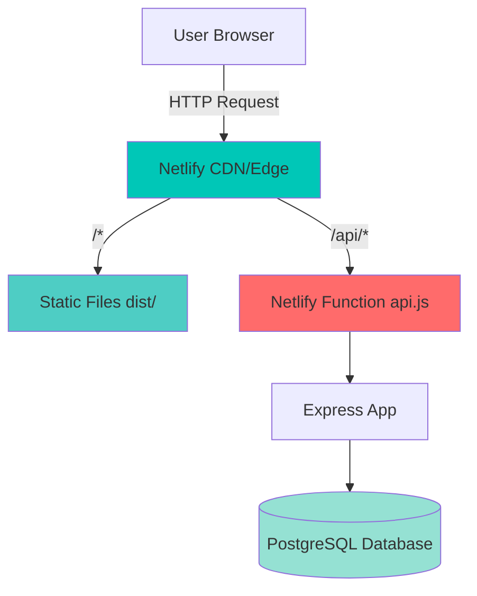

# Design Document

## Overview

This design describes a unified full-stack deployment architecture where a React frontend and Express.js backend are deployed together on Netlify. The frontend is served as static files from Netlify's CDN, while the backend runs as a serverless function. All requests to `/api/*` are routed to the backend function, and all other requests serve the React application.

## Architecture

### High-Level Architecture

```
User Request
    ↓
Netlify Edge (CDN)
    ↓
    ├─→ /api/* → Netlify Function (Express Backend)
    │                ↓
    │           PostgreSQL Database
    │
    └─→ /* → Static Files (React Frontend)
```

### Component Diagram



## Components and Interfaces

### 1. Frontend (React Application)

**Location**: `src/`, `pages/`, `components/`
**Build Output**: `dist/`

**Responsibilities**:
- Render the admin dashboard UI
- Handle client-side routing
- Make API requests to `/api/*` endpoints
- Manage authentication state in localStorage

**Key Files**:
- `services/api.ts`: API client that makes requests to `/api/*`
- `context/AuthContext.tsx`: Authentication state management
- `config/env.ts`: Environment configuration

**API Client Configuration**:
```typescript
// services/api.ts
const DEFAULT_API_BASE = '/api'; // Relative URL - same domain

async function request<T>(path: string, options?: RequestInit): Promise<T> {
  const url = `${DEFAULT_API_BASE}${path}`; // e.g., /api/auth/login
  const response = await fetch(url, options);
  // ... handle response
}
```

### 2. Backend (Express API in Netlify Function)

**Location**: `netlify/functions/api.js`
**Runtime**: Node.js 18 (Netlify Functions)

**Responsibilities**:
- Handle all API requests
- Authenticate users
- Manage wallet operations
- Query PostgreSQL database
- Return JSON responses

**Express App Structure**:
```javascript
const express = require('express');
const serverless = require('serverless-http');

const app = express();

// Middleware
app.use(cors());
app.use(bodyParser.json());

// Routes
app.post('/auth/login', ...);
app.post('/auth/signup', ...);
app.get('/wallet/balance', ...);
app.post('/wallet/credit', ...);
// ... more routes

// Export as serverless function
module.exports.handler = serverless(app);
```

**Database Connection**:
```javascript
const { Pool } = require('pg');

const pool = new Pool({
  host: process.env.DB_HOST,
  port: parseInt(process.env.DB_PORT || '5432'),
  database: process.env.DB_NAME,
  user: process.env.DB_USER,
  password: process.env.DB_PASSWORD,
  ssl: { rejectUnauthorized: false }
});
```

### 3. Netlify Configuration

**Location**: `netlify.toml`

**Routing Rules**:
```toml
# Redirect API calls to the serverless function
[[redirects]]
  from = "/api/*"
  to = "/.netlify/functions/api/:splat"
  status = 200
  force = true

# SPA fallback - serve index.html for all other routes
[[redirects]]
  from = "/*"
  to = "/index.html"
  status = 200
```

**Build Configuration**:
```toml
[build]
  command = "npm run build"
  publish = "dist"
  functions = "netlify/functions"

[build.environment]
  NODE_VERSION = "18"

[functions]
  node_bundler = "esbuild"
```

### 4. Environment Variables

**Frontend Variables** (VITE_ prefix, embedded at build time):
```
VITE_APP_NAME=ShopWallet
VITE_APP_VERSION=1.0.0
VITE_API_BASE_URL=/api
```

**Backend Variables** (Runtime, set in Netlify dashboard):
```
DB_HOST=<database-host>
DB_PORT=5432
DB_NAME=shopify_wallet
DB_USER=postgres
DB_PASSWORD=<secure-password>
BCRYPT_SALT_ROUNDS=12
DEFAULT_OTP_EXPIRY_SECONDS=120
CORS_ORIGIN=https://walletsz.netlify.app
```

## Data Models

### Request Flow Data Model

```typescript
interface APIRequest {
  method: 'GET' | 'POST' | 'PUT' | 'DELETE';
  path: string;           // e.g., '/api/auth/login'
  headers: Record<string, string>;
  body?: any;
}

interface APIResponse {
  status: number;
  headers: Record<string, string>;
  body: any;
}
```

### Database Connection Model

```typescript
interface DatabaseConfig {
  host: string;
  port: number;
  database: string;
  user: string;
  password: string;
  ssl: {
    rejectUnauthorized: boolean;
  };
}

interface ConnectionPool {
  query: (text: string, params: any[]) => Promise<QueryResult>;
  connect: () => Promise<PoolClient>;
  end: () => Promise<void>;
}
```

## Correctness Properties

*A property is a characteristic or behavior that should hold true across all valid executions of a system—essentially, a formal statement about what the system should do. Properties serve as the bridge between human-readable specifications and machine-verifiable correctness guarantees.*

### Property 1: API Route Isolation
*For any* request path starting with `/api/`, the request should be routed to the Netlify function and not serve static files.
**Validates: Requirements 1.3, 2.1, 2.2, 2.3**

### Property 2: Frontend Route Fallback
*For any* request path not starting with `/api/`, the request should serve the React application's index.html file.
**Validates: Requirements 1.1, 1.2, 7.3, 7.4**

### Property 3: Environment Variable Isolation
*For any* backend environment variable (DB_HOST, DB_PASSWORD, etc.), it should not be accessible from the frontend JavaScript bundle.
**Validates: Requirements 3.3**

### Property 4: Database Connection Persistence
*For any* sequence of API requests within a short time window, the database connection pool should be reused rather than creating new connections.
**Validates: Requirements 4.4, 9.3**

### Property 5: Request Parameter Preservation
*For any* API request with headers, query parameters, or body, all parameters should be preserved when routing from Netlify edge to the function.
**Validates: Requirements 2.4**

### Property 6: Error Response Safety
*For any* error response from the backend, it should not contain sensitive information such as database credentials, internal file paths, or full stack traces.
**Validates: Requirements 8.3, 10.3**

### Property 7: Static Asset Caching
*For any* static asset (JS, CSS, images) served from the frontend, it should include cache-control headers for CDN caching.
**Validates: Requirements 7.2, 9.4**

### Property 8: SSL Database Connection
*For any* database connection established by the backend, it should use SSL/TLS encryption.
**Validates: Requirements 10.1**

## Error Handling

### Frontend Error Handling

**Network Errors**:
```typescript
try {
  const response = await fetch(url, options);
  if (!response.ok) {
    throw new Error(`Server returned ${response.status}`);
  }
} catch (error) {
  // Display user-friendly error message
  console.error('API request failed:', error);
  throw error;
}
```

**Authentication Errors**:
- 401 responses → Redirect to login page
- 403 responses → Show "Access Denied" message
- Store errors → Clear localStorage and retry

### Backend Error Handling

**Database Errors**:
```javascript
try {
  const result = await db.query('SELECT * FROM users WHERE email = $1', [email]);
} catch (err) {
  console.error('Database error:', err);
  res.status(500).json({ error: 'Server error' }); // Generic message
}
```

**Validation Errors**:
```javascript
if (!email || !password) {
  return res.status(400).json({ error: 'Email and password required' });
}
```

**Authentication Errors**:
```javascript
if (!isMatch) {
  return res.status(401).json({ error: 'Invalid email or password' });
}
```

### Netlify Function Errors

**Cold Start Handling**:
- First request may be slower (function initialization)
- Connection pool established on first invocation
- Subsequent requests reuse warm function instance

**Timeout Handling**:
- Netlify functions have a 10-second timeout (free tier)
- Long-running queries should be optimized
- Consider pagination for large result sets

## Testing Strategy

### Unit Tests

**Frontend Unit Tests**:
- Test API client request formatting
- Test authentication context state management
- Test error handling in API calls
- Test environment configuration loading

**Backend Unit Tests**:
- Test individual route handlers
- Test database query construction
- Test password hashing and comparison
- Test input validation logic

**Example Unit Test**:
```javascript
describe('POST /auth/login', () => {
  it('should return 401 for invalid credentials', async () => {
    const response = await request(app)
      .post('/auth/login')
      .send({ email: 'test@example.com', password: 'wrong' });
    
    expect(response.status).toBe(401);
    expect(response.body.error).toBe('Invalid email or password');
  });
});
```

### Integration Tests

**API Integration Tests**:
- Test complete request/response cycle
- Test database connection and queries
- Test authentication flow end-to-end
- Test error scenarios (missing env vars, DB down)

**Deployment Integration Tests**:
- Test that `/api/*` routes to function
- Test that `/*` serves React app
- Test that static assets load correctly
- Test that environment variables are accessible

### Property-Based Tests

Each property test should run a minimum of 100 iterations.

**Property Test 1: API Route Isolation**
```javascript
// Feature: unified-deployment, Property 1: API Route Isolation
test('any path starting with /api/ routes to function', () => {
  fc.assert(
    fc.property(
      fc.string().filter(s => s.startsWith('/api/')),
      (path) => {
        const route = determineRoute(path);
        expect(route).toBe('function');
      }
    ),
    { numRuns: 100 }
  );
});
```

**Property Test 2: Frontend Route Fallback**
```javascript
// Feature: unified-deployment, Property 2: Frontend Route Fallback
test('any path not starting with /api/ serves React app', () => {
  fc.assert(
    fc.property(
      fc.string().filter(s => !s.startsWith('/api/')),
      (path) => {
        const route = determineRoute(path);
        expect(route).toBe('static');
      }
    ),
    { numRuns: 100 }
  );
});
```

**Property Test 3: Environment Variable Isolation**
```javascript
// Feature: unified-deployment, Property 3: Environment Variable Isolation
test('backend env vars not in frontend bundle', () => {
  const frontendBundle = fs.readFileSync('dist/assets/index.js', 'utf8');
  const backendEnvVars = ['DB_HOST', 'DB_PASSWORD', 'DB_USER'];
  
  backendEnvVars.forEach(envVar => {
    expect(frontendBundle).not.toContain(process.env[envVar]);
  });
});
```

### Manual Testing Checklist

- [ ] Visit root URL → React app loads
- [ ] Navigate to `/dashboard` → React app loads (client-side routing)
- [ ] Login with valid credentials → Successful authentication
- [ ] Login with invalid credentials → Error message displayed
- [ ] Make API request → Data returned correctly
- [ ] Check browser network tab → API requests go to `/api/*`
- [ ] Check Netlify function logs → Requests logged correctly
- [ ] Test with database down → Appropriate error message
- [ ] Test with missing env vars → Clear error in logs

## Deployment Process

### Step 1: Prepare Environment Variables

In Netlify dashboard (Site settings → Environment variables), add:
```
DB_HOST=<your-db-host>
DB_PORT=5432
DB_NAME=shopify_wallet
DB_USER=postgres
DB_PASSWORD=<your-password>
BCRYPT_SALT_ROUNDS=12
DEFAULT_OTP_EXPIRY_SECONDS=120
CORS_ORIGIN=https://your-site.netlify.app
```

### Step 2: Configure Build

Ensure `netlify.toml` is properly configured:
- Build command: `npm run build`
- Publish directory: `dist`
- Functions directory: `netlify/functions`

### Step 3: Deploy

```bash
# Option 1: Git push (automatic deployment)
git add .
git commit -m "Deploy unified app"
git push

# Option 2: Netlify CLI
netlify deploy --prod
```

### Step 4: Verify Deployment

1. Check build logs for errors
2. Visit site URL
3. Test login functionality
4. Check function logs for any errors
5. Verify database connectivity

## Performance Considerations

### Frontend Optimization
- Vite automatically code-splits and tree-shakes
- Static assets served from Netlify CDN
- Gzip compression enabled by default

### Backend Optimization
- Connection pooling reduces DB connection overhead
- Serverless functions reuse warm instances
- Keep function code minimal (only Express app)

### Database Optimization
- Use connection pooling (pg Pool)
- Index frequently queried columns
- Use prepared statements (parameterized queries)
- Limit result set sizes with pagination

## Security Considerations

### Frontend Security
- No sensitive data in frontend code
- API keys and secrets only in backend
- HTTPS enforced in production
- XSS protection via React's built-in escaping

### Backend Security
- Password hashing with bcrypt (12 rounds)
- SQL injection prevention via parameterized queries
- Input validation on all endpoints
- Generic error messages (no stack traces to client)

### Database Security
- SSL/TLS connections required
- Credentials stored in environment variables only
- Principle of least privilege for DB user
- Regular security updates

## Monitoring and Debugging

### Netlify Function Logs
Access via: Netlify Dashboard → Functions → api → Logs

**What to monitor**:
- Function invocation count
- Error rates
- Execution duration
- Cold start frequency

### Database Monitoring
- Connection pool size
- Query execution time
- Failed connection attempts
- Active connections

### Frontend Monitoring
- Browser console errors
- Network request failures
- API response times
- User authentication issues
